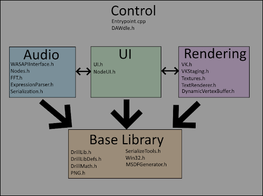
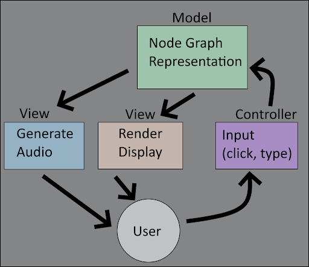
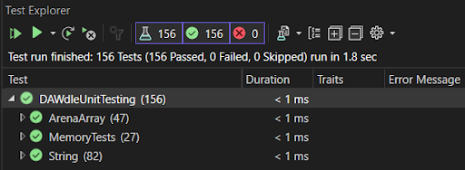

# DAWdle

## Overview

DAWdle, a digital audio workstation with a built-in visual node-based scripting language.
- **Tech stack:** C++, using Vulkan for rendering (previously C++ with Qt)
- For more comprehensive documentation, [click here](docs/DAWdle%20Final%20Report.pdf) for our full report

---

## Software Design

### I. Software Architecture

At a high level, this project is split into three major components: Audio, UI, and rendering, with a shared base library layer. The top-level file, `DAWdle.h`, ties the components together and manages the program main loop.

The project uses a single compilation unit in order to reduce build friction and lessen compilation time (theoretically having multiple compilation units helps with compile time, but in practice that often isn’t the case), so every file is a header that’s included into `Entrypoint.cpp` for compilation. Normally you would include cpp files and run the compiler on only one cpp file, but we used headers in order to avoid Visual Studio automatically compiling every cpp file. So, `FileName.h` is what you’d normally consider a cpp file, and `FileName_decl.h` is what you’d normally consider a header file (though in this project it’s only for resolving circular file dependency issues).

We use a simple two-threaded model, one thread for UI and rendering and the other for audio. The only reason audio is on a separate thread at all is so that rendering doesn’t block it and cause issues if the frame rate is too low or VSync is enabled.

---

### Audio Component

This project exclusively uses WASAPI on Windows to output audio. The audio thread wakes up when half the audio buffer should be empty and calls into the node graph to generate however many audio samples are needed to fill it up to full. For performance reasons, the audio graph always processes audio buffers in blocks of 1024 samples, saving any leftover samples for the next time the audio thread wakes up and needs more data.

The audio graph was originally designed to be a function of time, as in “for x time, what is the audio output value?”. In hindsight, while this did make processing very vectorizable, it also puts a lot of limitations on the user, since they have to do everything as a function of time now instead of sequentially, which is much easier to think about for certain effects. Effects such as reverb also don’t tend to work well as a pure function of time, since they require information from the past.

The audio graph itself uses an MVC architecture. The `NodeGraph` class acts as the model, holding all data related to the graph. That model is then viewed by both the audio thread for generating output and the render component for drawing the nodes on screen. The UI system acts as the controller, providing user input for changing the node graph.

---

### UI Component

The UI system is a retained mode GUI based around boxes. Each box represents a single UI element, such as a text string or a button. Every box has the necessary fields for everything any box could do. While this increases memory usage, it also provides a lot of flexibility, since if you want a clickable box with an outline and a specific hover cursor and a particular tooltip, you don’t need to make a new class for that; you just set the necessary fields in the box to enable each bit of functionality.

To provide custom behavior, boxes can define an action callback which gets called whenever something interesting happens to the box (such as the box rendering, or the user clicking on it). These action callbacks take a box and a `UserCommunication` struct as input. The `UserCommunication` struct contains all the information being communicated through the callback, such as whether the box was left clicked, what key was pressed while the box was selected, or what the current mouse position is. While we could have had different callbacks for each possible action, I (Evan) personally found it to be much simpler to have only one callback that handles everything.

Each frame, the UI system computes a dynamic layout for each box, which automatically resizes when necessary. This means the programmer does not have to manually specify coordinates for each box.

---

### Render Component

The renderer is designed using the Vulkan graphics API. Every frame, the UI system puts triangle data into a CPU-side vertex buffer, which is then read by the GPU to draw the UI. A bindless architecture is used for rendering, with every texture stored in a big array. The whole UI is drawn in a single draw call.

Vulkan may not have been the optimal API to use for this project, since it’s geared toward extremely high-performance large-scale renderers, not flat color UIs that maybe draw a couple of textures. Vulkan tries to do as much as it can at load time so that performance during rendering is very fast, which meant that startup time took significantly (around 0.2 seconds) longer, and memory usage was significantly higher (several hundred megabytes of overhead for initializing Vulkan). Power usage was also worse since the UI is redrawn each frame at a high frame rate. While I (Evan) personally like Vulkan quite a lot, it wasn’t the right choice for a project that does zero complex rendering. A basic CPU-side software rasterizer with no graphics API may have been a better choice.

---

### Base Library

This project originally compiled without using the C or C++ standard library at all, which meant a good deal of functionality had to be rewritten from scratch. After more people started using it, the standard library was added back in for their convenience, making much of this base library unnecessary. However, I (Evan) actually like many of my standard systems more than the C/C++ standard ones (they tend to be simpler, or more performant, or have a nicer interface than their counterparts), so I continued to use the base library for most of my work.

The base library (`DrillLib.h`, `DrillLibDefs.h`) includes things like common constants, conversion macros, data structures (array lists and strings), serialization helpers, functions for printing to the console, reading and writing files, running external programs, and memory allocators. There is also a math library (`DrillMath.h`) containing things like small vectors, matrices, and quaternions suitable for computer graphics, trig functions (`sin/cos/atan2`, etc.). Note that angles in this project are defined in terms of turns, not radians or degrees. I (Evan) firmly believe that turns are a much nicer unit for angles in practice, and tend to remove a lot of multiplies by 2π, floating-point helpers (`fract`, `round`, `ceil`, etc.), variadic min/max functions, bezier curve functions, and more.

The project is based heavily around arena allocation, which is a type of very fast memory allocator that makes it easy to manage large groups of objects with the same lifetime (you don’t have to track object lifetimes individually; once you’re done with a set of objects with the same lifetime, you can free them all at once just by resetting a single allocation offset). The audio system uses arena allocators heavily for evaluating audio buffers. The arena allocators in this particular project reserve a gigabyte of memory, but importantly do not actually commit this memory until it is used (we use a page fault handler to commit more memory if the program faults on access to an arena). This means that we can have a big linear block of memory that only consumes as much actual memory as we need.

There are several smaller components to the base library, including a PNG reader for loading textures, an MSDF generator for generating signed distance fields for icons and fonts, an OS layer for communicating with Windows and providing some degree of separation to make it easier to refactor into OS independence, and a selection of serialization tools for doing things like parsing text and converting floating-point numbers to ASCII.

The project was originally designed with C-style C++ in mind, so no constructors/destructors, no RAII, no `new`/`delete`, no move semantics. I (Evan) consider modern C++ memory features to be a real pain to program with, so nearly everything is a simple POD struct. This means no special constructors have to be defined, and copying or assigning a struct always behaves predictably. It also means memory can be moved around as a raw memory block without concern for the C++ object model. Lifetimes of objects are also typically managed either in bulk with arenas or with block allocators, no smart pointers to individually manage object lifetimes.

---

## Verification

### I. Test Infrastructure

Since we have such a large code base, most of it largely not unit-testable, we chose a two-pronged approach to our testing.

Firstly, we did employ unit testing where applicable. Prioritizing quality over quantity, we concentrated our efforts on writing the most exhaustive test suites we could for the most important and foundational classes and functions in the project. We managed to cover two vital classes (a string class and a dynamic array class used in place of `std::string` and `std::vector` respectively) and some vital memory-related functions (mostly drop-in replacements for classic C standard library functions). In making these tests we used Visual Studio’s built-in unit test functionality with the Google gtest testing library and used OpenCPPCoverage to track code coverage.

For the future, we recommend implementing exhaustive unit tests for other functions and classes in the code as we were far from able to cover all the unit-testable functionality in the project. Additionally, the rigor of these tests is currently only supported by our own intuition and simple code coverage metrics, so getting some additional confirmation on that via something like mutation testing is also recommended.

The second aspect of our testing approach was extensive subjective testing. Our subjective testing was feature-based, meaning that each subjective test measured the quality, performance, and auditory/visual characteristics for an isolated feature or limit. The purpose of this subjective testing was to cover the important parts of our application that were not easily unit-testable (e.g. the user interface, the actual node system, and the audio synthesis and playback).

---

### II. Test Results

---

### III. Test Quality

#### Unit Testing

Using the code coverage tool OpenCPPCoverage, we analyzed the test coverage to ensure that every possible path of every function tested was executed in at least one test. Even when the tool reported 100% coverage we often continued adding tests for a particular function until we felt every single reasonably unique case was covered.

#### Subjective Testing

The subjective testing consisted of three key steps: thinking of a situation the user might find themselves in while using the application, setting up such a situation in the application, and analyzing the actual behavior of the program in that situation.

---

## Software Engineering Team

### Aidan Raymond (Tabris05)

**Pull Requests Contributed To:**
- vkDAWdle (current build)
  - Unit testing
  - Serialization
  - Expression Parsing
  - Sampler Node
- QtDAWdle (legacy build)
  - Sampler Node
  - Serialization
  - Refactor Arithmetic Nodes
  - Audio Output

**Approved PRs:**
- FFTs
- Filters
- Waveforms
- Bug Fixes
- Device Selection
- Arithmetic Nodes
- Initial Setup

**Other Responsibilities:**
- Scrum Master
- Ran code coverage testing

**Full Commit History:**
[Click here for the full log](https://github.com/ChicoState/DAWdle/commits?author=Tabris05)

---

### Adam Ullmann (AdamUllmann)

**Pull Requests Authored or Contributed To:**
- vkDAWdle (current build)
  - Clear Button
  - Unit Testing
  - Filters
  - Waveforms
  - Serialization
  - Oscilloscope
- QtDAWdle (legacy build)
  - Fullscreen Fix
  - Bug Fixes (Dynamic Sample Rate & arithmetic node crash fix)
  - Basic Tone Generators
  - Basic Input, Output, and Sine tone

**Approved PRs:**
- Piano Roll
- Array Testing
- UI update
- Port Sampler Node
- README
- Control Sample Speed
- Pause Button
- PortAudio Refactor
- Serialization (QtDAWdle)
- UI Freeze Fix
- Fix Sample Rate Value
- Add QtNodes

**Other Responsibilities:**
- DAWdle Project Author: Implemented sample DAWdle projects and prepared all demos
- Created an early tone generator & filter routing prototype with the PortAudio library (seperate repo)

**Full Commit History:**
[Click here for the full log](https://github.com/ChicoState/DAWdle/commits?author=AdamUllmann)

---

### Steven Lam (slam210)

**Pull Requests Contributed To:**
- [Initial Construction](https://github.com/ChicoState/DAWdle/pull/1)
- [Node Toolbar](https://github.com/ChicoState/DAWdle/pull/6)
- [Initial Arithmetic](https://github.com/ChicoState/DAWdle/pull/8)
- [Arithmetic](https://github.com/ChicoState/DAWdle/pull/9)
- [Code Migration + PianoRoll](https://github.com/ChicoState/DAWdle/tree/QtDAWdle)

**PR Reviews:**
- [Library Updates](https://github.com/ChicoState/DAWdle/pull/2)
- [Audio Output](https://github.com/ChicoState/DAWdle/pull/7)
- [Library Updates](https://github.com/ChicoState/DAWdle/pull/30)
- [Issue Fix for Audio](https://github.com/ChicoState/DAWdle/pull/39)
- [Clear Graph](https://github.com/ChicoState/DAWdle/pull/40)

**Other Responsibilities:**
- Subjective Test Maker

**Full Commit History:**
[Click here for the full log](https://github.com/ChicoState/DAWdle/commits?author=Slam210)

---

### Evan Pottier (Drillgon200)

**PRs authored:**
- VkDAWdle
  - Base code for VkDAWdle
  - Fix resize lag
  - UI update
  - Piano Roll
  - Fix for audio not playing without a piano roll
  - Fast Fourier Transform
- QtDAWdle (legacy build)
  - Device Selection
  - Fix samplerate value
  - UI freeze fix

**Approved PRs:**
- Fix arithmetic audio
- Fix white bar in fullscreen
- Move vkdawdle to main branch
- Unit Testing
- Fix blindspots in testing

**Other Responsibilities:**
- Wrote Core architecture of vkDAWdle
- Provided documentation for vkDAWdle
- Authored the software architecture section of this readme

**Full Commit History:**
[Click here for the full log](https://github.com/ChicoState/DAWdle/commits?author=Drillgon200)

---

### Ray Perez (raperez2)

**Pull Requests Contributed To:**
- Array Test Pseudocode
- ByteBuff Test Pseudocode

**Full Commit History:**
[Click here for the full log](https://github.com/ChicoState/DAWdle/commits?author=raperez2)

---

### Caleb Ray (epicgy12)

**Pull Requests Contributed To:**
- Update test.cpp (later changed to UnitTesting.cpp)

**Full Commit History:**
[Click here for the full log](https://github.com/ChicoState/DAWdle/commits?author=epicgy12)

---

